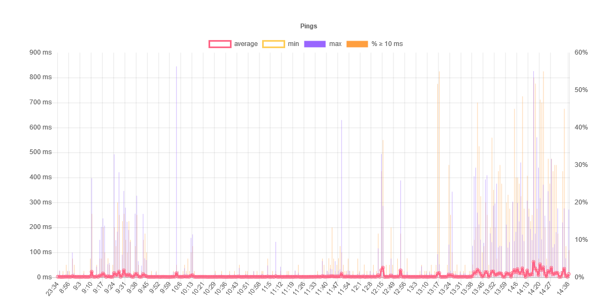

# Ping graph

Graph pings in your browser. All it does is great a web server that reads number
from the stdout, writes them to a file and every {delay} seconds, sends nice
statistics to the client (through websockets).

## Why

Because my laptop (which I put under Linux) is quite slow (not because of Linux,
but it just so old). So, with my desktop computer (that's under windows), I use
it as a sort of web server, where I do all of my dev from. The problem being
that when our router started to get slow for some reason (500ms ping), using ssh
was somewhat annoying. So, I made this little thing to try to find some patterns
and find the culprit on our local network :smile:

## Example

For now, you have to use a separate utility that pings for you (the `awk`
command is just used to filter everything out and just print the milliseconds)

```sh
$ ping 192.168.0.1 | awk  '/from/ { split($7, resArr, "="); print resArr[2] }' | pinggrapher
```

And if you let it run long enough, you should get something that hopefully has
less bars than this:



## What's it made of?

A Go file which act as the web server, with [ws](https://github.com/gobwas/ws)
for the web socket, and some vanilla JavaScript on the front end, with
[Chart.js](https://github.com/chartjs) for the nice graphs.
